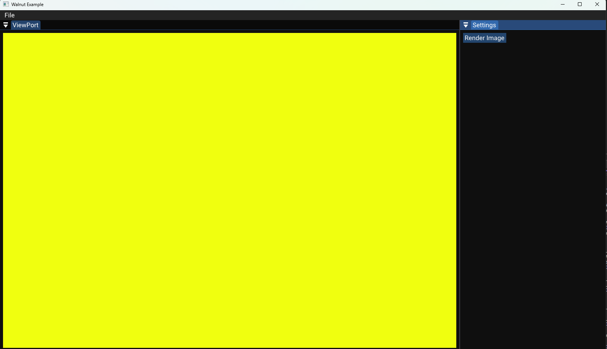

# Ray-Tracing

This is a simple raytracer I made following the Cherno's raytracing series. 

The goal of this project was to get my feet wet in graphics programming! I felt that was the best choice as it uses some vulkan and goes into muiltthread code in C++.
Ray-Tracing uses a template from [Walnut](https://github.com/TheCherno/Walnut) to handle window, ui, rendering set up, while the core raytracing code is wrote by me!

## Building the project
If you want to build the project you can using the ``scripts/Setup.bat`` file and it will generate VS 2022 project for you. You must ensure that you have the vulkan SDK on your PC or this will not work!

## Progess Log

### Day 1

 
